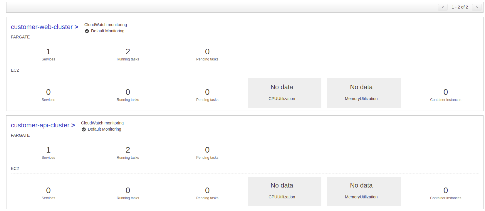
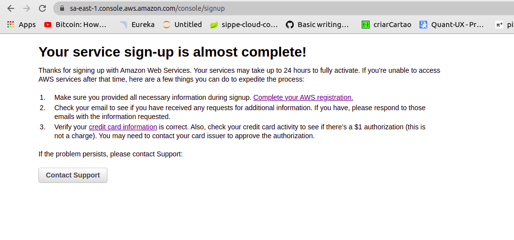
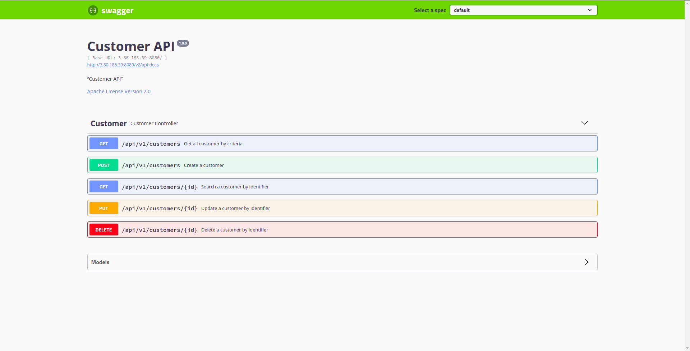

[](https://sonarcloud.io/dashboard?id=New-Customer-API_customer-api)
[](https://sonarcloud.io/dashboard?id=New-Customer-API_customer-api)
[](https://sonarcloud.io/dashboard?id=New-Customer-API_customer-api)
[](https://sonarcloud.io/dashboard?id=New-Customer-API_customer-api)
# Customer API

* To run:

```
$ docker-compose up
```

* Open in browse http://localhost:8080/swagger-ui.html

* Technologies Used:
    1. Java 8
    2. Docker 
    3. Docker compose
    4. Spring Framework
    5. MongoDB Atlas
    6. AWS ECS
    7. CircleCI
    8. Sonar Cloud
    
OBS: I tried to use terraform to create the infrastructure, but I did it manually.

* Images from AWS:

Clusters:

<p align="center">
  
</p>

Services:

<p align="center">
  
</p>

API Documentation:

<p align="center">
  
</p>
